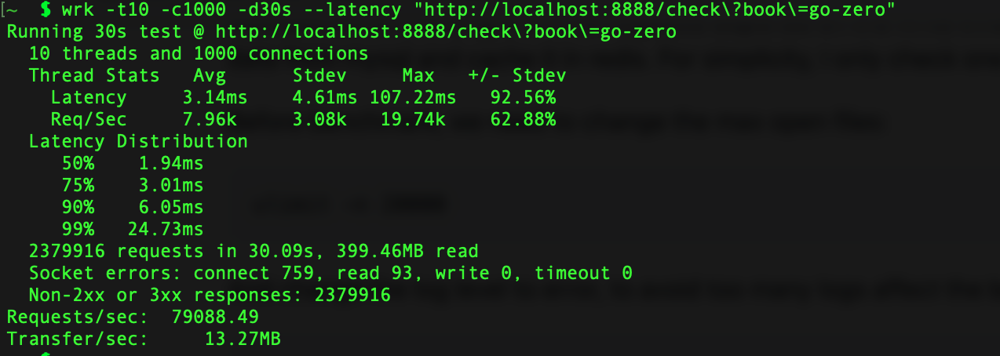

# 环境依赖
使用到的三个依赖：mysql，etcd，redis
由于本身mac就安装了mysql所以mysql就不从docker启动，本机已经启动，另外的etcd和redis使用docker启动

## docker start etcd
### Step 1:pull image
```shell 
docker pull bitnami/etcd:latest
```
### Step 2: Create a network
```shell 
docker network create app-tier --driver bridge
```
### Step 3: Launch the etcd server instance
```shell 
docker run -d --name etcd-server \
    --network app-tier \
    --publish 2379:2379 \
    --publish 2380:2380 \
    --env ALLOW_NONE_AUTHENTICATION=yes \
    --env ETCD_ADVERTISE_CLIENT_URLS=http://etcd-server:2379 \
    bitnami/etcd:latest
```
## docker start redis
### Step 1:pull image
```shell 
docker pull redis:latest
```
### Step 2:  Launch the redis server instance
```shell 
docker run --name redis -p 6379:6379 -d redis
```

### benchmark
```shell
wrk -t10 -c1000 -d30s --latency "http://localhost:8888/check\?book\=go-zero"
```



